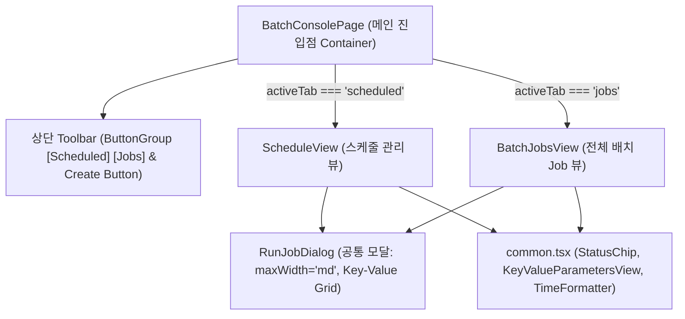

# BatchConsole UI 개선: ButtonGroup 탭 전환 및 스케줄 상태/메타데이터 보정 스펙

## 목표
`SpringBatchPage` 스타일의 상단 `ButtonGroup`(`[Scheduled] [Jobs]`)을 도입하여 사용자가 한 화면에서 스케줄 목록과 전체 배치 Job 목록을 자연스럽게 전환하며 모니터링할 수 있도록 컨테이너 구조를 개편하고, 피드백된 UI/데이터 문제를 해결한다:
1. **상단 ButtonGroup 탭 구조 도입**:
   - 메인 진입 페이지(`BatchConsolePage.tsx`) 상단에 `ButtonGroup`(`[Scheduled] [Jobs]`)을 배치하여 클릭 시 `ScheduleView`와 `BatchJobsView`를 전환 렌더링.
   - 뷰 컴포넌트를 분리하여 파일당 단일 책임(SRP)을 유지하고 스파게티화를 방지.
2. **테이블 및 Expended(상세 패널) 색상 대비 개선 (Scheduled & Jobs 공통)**:
   - 하드코딩된 라이트 모드 전용 색상(`rgba(...)`, `#fafafa`)을 전면 제거하고 테마 팔레트(`theme.palette.text.secondary`, `theme.palette.action.hover`, `theme.palette.background.paper`, `theme.palette.divider` 등)와 연동하여 다크/라이트 테마 모두에서 완벽한 가독성 확보.
3. **BatchJobsView (Jobs 탭) UI 개편**:
   - `Job Name` 컬럼의 불필요한 링크(`<Link>`) 제거하고 순수 텍스트(Typography)로 표시.
   - Actions의 Run 아이콘 버튼을 Schedule과 동일하게 Outlined text `Run` 버튼(`startIcon={<PlayArrowIcon />}`)으로 교체.
   - Run 버튼 클릭 시 기존의 별도 페이지 이동 대신, Schedule의 Run 다이얼로그와 완전히 동일한 레이아웃(`maxWidth="md"`, Key-Value 파라미터 입력 Grid, Launch 기능)의 팝업 모달을 표시.
   - Job 선택은 이미 클릭한 행의 Job으로 자동 고정(선택 완료 상태)되어 파라미터만 편리하게 입력 후 즉시 실행.
   - Jobs는 Spring 컨텍스트에 등록된 정적 빈 목록이므로 Edit / Delete 버튼을 제공하지 않음(기존 정책 유지).
4. **ScheduleView (Scheduled 탭) UI 개편**:
   - 컬럼 순서 재배치: `Job Name` -> `Cron Expression` -> `Last Status` -> `Last Run` -> `Created At` -> `Actions`
   - `Created At` 표시 보정: 등록일 정보가 없으면 `null` 유지하여 UI에서 `-` (하이픈) 표시.
   - Run: `PlayArrow` 아이콘이 포함된 Outlined `Run` 텍스트 버튼 적용.
   - History: 튀는 파란 링크 색상 제거, 주변 단색 톤(`color="action"`) 적용.
   - **Edit & Delete 버튼 유지**: 스케줄은 DB 영속 엔티티로 언제든 수정 및 삭제가 가능하므로 정상 유지(활성화).
   - Parameters 상세 패널: YAML 대신 직관적인 `Key : Value` 카드 그리드 형태로 출력.
5. **Create 버튼 위치 및 조건부 노출**:
   - `InfoCard` 타이틀 내부에서 테이블 상단 우측으로 분리 이동.
   - `Scheduled` 탭이 활성화되어 있을 때만 우측 상단에 노출.
6. **Last Status 무조건 FAILED 현상 해결 (백엔드)**:
   - `WorkflowSchedulerConfig.java`의 `workflowJobTask` 실행 시 `taskInstance.getId()`(UUID) 대신 실제 `wsd.content().name()`을 잡 이름으로 넘기도록 수정하여 불필요한 예외 발생 차단.
   - `DbJobSchedulerRepository.java`에서 실행 기록이 없거나 유효하지 않은 경우 `null` (`-`)로 안전하게 매핑.
   - `WorkflowScheduleData` 역직렬화 시 `Instant.now()` 강제 주입 제거.

---

## 사용자 UX 시나리오 (User Journey & Scenarios)

`batch-console` 플러그인은 플랫폼 엔지니어 및 애플리케이션 운영자가 배치 작업을 중앙에서 탐색, 스케줄링, 수동 실행, 모니터링하기 위한 핵심 도구이다. 주요 사용자 시나리오는 다음과 같다:

### 시나리오 1: 전체 배치 작업 현황 점검 및 뷰 전환 (Navigation & Exploration)
- **사용자 목표**: 등록된 정기 스케줄 목록과 클러스터에 존재하는 전체 배치 Job 메타데이터를 빠르게 전환하며 상태를 모니터링한다.
- **여정**:
  1. 사용자가 Backstage 사이드바에서 `Batch Console` 메뉴로 진입한다.
  2. 기본으로 노출되는 `[Scheduled]` 탭에서 활성화된 스케줄의 Cron 주기, 마지막 실행 상태(`SUCCESS` / `FAILED` / `-`), 마지막 실행 시점을 한눈에 확인한다.
  3. 상단 ButtonGroup의 `[Jobs]`를 클릭하여 시스템에 정의된 전체 Spring Batch Job(재시작 가능 여부, 총 실행 횟수 등) 목록으로 매끄럽게 전환한다.

### 시나리오 2: 신규 정기 배치 스케줄 등록 (Create Schedule)
- **사용자 목표**: 특정 배치 Job을 원하는 주기에 맞춰 주기적으로 자동 실행하도록 스케줄을 생성한다.
- **여정**:
  1. `Scheduled` 탭 우측 상단의 `Create` 버튼을 클릭한다.
  2. 모달 다이얼로그에서 대상 `Job Name`을 드롭다운에서 선택하고, `Cron Expression`(예: `0 0 * * * ?`)을 입력한다.
  3. 스케줄 실행 시 함께 전달할 기본 파라미터(Key-Value)를 추가하고 `Save`를 클릭한다.
  4. 다이얼로그가 닫히며 목록에 신규 스케줄이 추가되고 생성 완료 알림이 뜬다.

### 시나리오 3: 스케줄 상세 확인 및 관리 (Inspect & Manage Schedule)
- **사용자 목표**: 기존 스케줄의 파라미터가 무엇인지 확인하고, 주기를 변경하거나 불필요한 스케줄을 삭제한다.
- **여정**:
  1. 스케줄 테이블의 특정 행을 클릭하면 하단 아코디언이 열리며 테마에 맞춤화된 카드 그리드 형태로 등록된 `Key : Value` 파라미터들이 표시된다.
  2. 주기를 변경해야 할 경우 Actions 열의 `Edit` 아이콘을 클릭하여 Cron 또는 파라미터를 수정하고 저장한다.
  3. 더 이상 정기 실행이 불필요한 스케줄은 `Delete` 아이콘을 클릭하여 삭제 확인 후 안전하게 제거한다.

### 시나리오 4: 스케줄된 작업을 수동으로 즉시 1회성 실행 (Manual Trigger from Schedule)
- **사용자 목표**: 정기 실행 시간까지 기다리지 않고, 스케줄에 기등록된 파라미터를 바탕으로 즉시 배치 작업을 검증/실행한다.
- **여정**:
  1. 특정 스케줄 행의 Actions 열에서 Outlined `Run` 버튼을 클릭한다.
  2. `RunJobDialog`(`maxWidth="md"`)가 팝업되며 대상 `Job Name`이 고정되고, 스케줄에 기설정된 파라미터들이 Key-Value 행으로 자동 채워진다(Prefill).
  3. 파라미터를 필요에 따라 보정하거나 그대로 둔 후 `Run`을 클릭한다.
  4. 즉시 실행 요청이 성공하며 Execution ID 토스트가 노출되고 모달이 닫힌다.

### 시나리오 5: 전체 Job 목록에서 특정 잡 즉시 실행 (Ad-hoc Job Run)
- **사용자 목표**: 정기 스케줄에 등록되지 않은 배치 Job이나 일회성 마이그레이션 잡을 원하는 파라미터와 함께 즉시 트리거한다.
- **여정**:
  1. 상단 `[Jobs]` 탭을 클릭하여 전체 배치 Job 목록으로 이동한다.
  2. 원하는 Job 행의 Actions 열에서 Outlined `Run` 버튼을 클릭한다.
  3. `RunJobDialog`가 팝업되며 해당 Job Name이 타이틀에 고정되고, 파라미터 입력 필드가 열린다.
  4. 필요한 파라미터(예: `targetDate=2026-10-02`)를 추가 입력하고 `Run`을 클릭하여 작업을 실행한다.

### 시나리오 6: 작업 실행 이력 및 세부 스텝 추적 (Execution History Deep-dive)
- **사용자 목표**: 마지막 실행이 실패했거나 상세 실행 로그/스텝 소요 시간을 분석하기 위해 히스토리 화면으로 이동한다.
- **여정**:
  1. 특정 스케줄 또는 Job 행의 Actions 열에서 `History` 아이콘 버튼을 클릭한다.
  2. Spring Batch Dashboard(`/spring-batch`)로 이동하여 실행 인스턴스, 소요 시간, 실패 예외 로그를 심층 분석한다.

---

## 직관적이지 않은 UX 요소 평가 및 최종 결정 사항 (UX Gap Analysis & Decisions)

사용자 피드백 및 검토를 거쳐 확정된 UX 설계 결정 사항은 다음과 같다:

| 구분 | 검토 항목 (UX Gap Evaluation) | 결정 사항 (Final Decision) | 상세 구현 및 반영 방식 |
|---|---|---|---|
| **1. History 버튼 동작** | 특정 Job 이력으로 바로 딥링크할지 여부 | **단순 페이지 이동만 수행** | `spring-batch-dashboard`의 별도 수정 없이, 기존대로 `/spring-batch` (전체 대시보드 홈)로 단순 라우트 이동을 유지한다. 아이콘 색상은 단색 톤(`color="action"`)으로 조화롭게 유지. |
| **2. Jobs 탭 액션 및 Create 버튼** | Jobs 테이블에 Schedule 생성 액션 추가 여부 및 Create 버튼 노출 제어 | **Jobs 탭은 Run / History만 유지, Create 버튼은 Jobs 탭에서 비노출** | Jobs 테이블에는 `Run`과 `History` 2개 액션만 제공하며, 상단 Toolbar의 `Create` 버튼은 `Scheduled` 탭에서만 활성화되고 `Jobs` 탭에서는 완전히 숨긴다. |
| **3. 상단 ButtonGroup 탭 전환** | 탭 상태 새로고침 및 공유 지원 여부 | **URL 쿼리 파라미터(`?tab=...`)와 양방향 동기화** | `useSearchParams`를 적용하여 `?tab=jobs` / `?tab=scheduled`와 버튼 그룹 활성 상태를 동기화하여 F5 새로고침 및 북마크를 완벽히 지원한다. |
| **4. 수동 Run 다이얼로그 안내** | 수동 실행 결과와 스케줄 상태 불일치 가능성 | **다이얼로그 헬퍼 텍스트 명시** | `RunJobDialog` 설명 문구에 "수동 즉시 실행은 정기 스케줄 상태와 독립적으로 실행됩니다"를 명시하여 사용자 혼란을 방지한다. |

---

## 아키텍처 및 컴포넌트 계층 구조



---

## 구현 대상 파일 명세

| 대상 유형 | 파일/패키지 경로 | 클래스/컴포넌트명 | 주요 역할 및 설명 |
|---|---|---|---|
| 수정 (Backend) | `ingestion/src/main/java/io/slim/workflow/app/adapter/scheduler/WorkflowScheduleData.java` | `WorkflowScheduleData` | `createdAt` 필드가 null일 때 `Instant.now()`로 채우지 않고 null 유지 |
| 수정 (Backend) | `ingestion/src/main/java/io/slim/batch/console/scheduler/DbJobSchedulerRepository.java` | `DbJobSchedulerRepository` | 실행 이력이 없거나 유효하지 않은 경우 `lastStatus = null` (`-`) 처리 |
| 수정 (Backend) | `ingestion/src/main/java/io/slim/workflow/app/adapter/scheduler/WorkflowSchedulerConfig.java` | `WorkflowSchedulerConfig` | 태스크 실행 시 `taskInstance.getId()`(UUID) 대신 `taskData.content().name()`을 넘겨 정상 실행 보장 |
| 수정 (Frontend) | `backstage/plugins/batch-console/src/components/common.tsx` | `common.tsx` | 테마 연동 스타일 적용, Key-Value 뷰어 컴포넌트 추가, `formatRelativeOrAbsoluteTime` null 안전성 강화 |
| 신규 (Frontend) | `backstage/plugins/batch-console/src/components/RunJobDialog.tsx` | `RunJobDialog` | ScheduleView와 BatchJobsView에서 공통 사용하는 즉시 실행 모달 (`maxWidth="md"`, Key-Value 파라미터 입력 Grid, 고정된 jobName) |
| 신규/분리 (Frontend) | `backstage/plugins/batch-console/src/components/ScheduleView.tsx` | `ScheduleView` | 기존 SchedulePage 로직을 독립 뷰로 분리: 테마 호환 테이블, 컬럼 순서 변경, Key-Value 패널, Run 텍스트 버튼, History 톤 일치, **Edit/Delete 버튼 유지** |
| 신규/분리 (Frontend) | `backstage/plugins/batch-console/src/components/BatchJobsView.tsx` | `BatchJobsView` | 기존 BatchJobsPage 로직을 독립 뷰로 분리: 테마 호환 테이블, JobName 링크 제거(텍스트화), Run Outlined 버튼, RunJobDialog 모달 연동, History 톤 일치 |
| 수정 (Frontend) | `backstage/plugins/batch-console/src/components/BatchConsolePage.tsx` | `BatchConsolePage` | [메인 진입점] 상단 ButtonGroup([Scheduled] [Jobs]) + Create 버튼 + 탭 전환 컨테이너 |
| 수정 (Frontend) | `backstage/plugins/batch-console/src/components/SchedulePage.tsx` | `SchedulePage` | `ScheduleView`를 래핑하거나 `BatchConsolePage?tab=scheduled`로 연결하는 하위 호환 export |
| 수정 (Frontend) | `backstage/plugins/batch-console/src/plugin.tsx` / `index.ts` | 플러그인 정의 | `batchConsolePage`, `schedulePage` 라우트 매핑 및 하위 호환 유지 |
| 수정 (Frontend Test) | `backstage/plugins/batch-console/src/components/BatchConsolePage.test.tsx` | 테스트 | 상단 ButtonGroup 클릭 시 탭 전환 렌더링 및 Create 버튼 노출 여부 검증 |
| 수정 (Frontend Test) | `backstage/plugins/batch-console/src/components/ScheduleView.test.tsx` | 테스트 | 신규 컬럼 순서, Run 텍스트 버튼, Edit/Delete 버튼 유지, Key-Value 상세 패널 검증 |
| 수정 (Frontend Test) | `backstage/plugins/batch-console/src/components/BatchJobsView.test.tsx` | 테스트 | JobName 비링크(텍스트), Outlined Run 버튼 및 RunJobDialog 오픈 검증 |
| 수정 (Backend Test) | `ingestion/src/test/java/io/slim/batch/console/scheduler/DbJobSchedulerRepositoryTest.java` | 테스트 | null createdAt 및 미실행 상태 매핑 단위 테스트 검증 |

---

## 구체적인 구현 샘플 및 구조 (방향 고정)

### 1. [진입점] `BatchConsolePage.tsx`
상단에 `ButtonGroup`과 `Create` 버튼을 배치하고 URL 쿼리 파라미터(`?tab=jobs` / `?tab=scheduled`)와 연동하여 뷰를 전환한다. (`Create` 버튼은 `Scheduled` 탭에서만 조건부 노출)
```tsx
import { useState } from 'react';
import { useSearchParams } from 'react-router-dom';
import { Page, Content } from '@backstage/core-components';
import Box from '@material-ui/core/Box';
import Button from '@material-ui/core/Button';
import ButtonGroup from '@material-ui/core/ButtonGroup';
import { ScheduleView } from './ScheduleView';
import { BatchJobsView } from './BatchJobsView';

export type BatchConsoleTab = 'scheduled' | 'jobs';

export const BatchConsolePage = () => {
  const [searchParams, setSearchParams] = useSearchParams();
  const tabParam = searchParams.get('tab');
  const activeTab: BatchConsoleTab = tabParam === 'jobs' ? 'jobs' : 'scheduled';
  const [createDialogOpen, setCreateDialogOpen] = useState(false);

  const handleTabChange = (tab: BatchConsoleTab) => {
    setSearchParams({ tab });
  };

  return (
    <Page themeId="tool">
      <Content>
        {/* 상단 툴바: 좌측 ButtonGroup, 우측 Create 버튼 (Scheduled 탭 전용 노출) */}
        <Box display="flex" justifyContent="space-between" alignItems="center" mb={2}>
          <ButtonGroup variant="outlined" size="small">
            <Button
              variant={activeTab === 'scheduled' ? 'contained' : 'outlined'}
              color={activeTab === 'scheduled' ? 'primary' : 'default'}
              onClick={() => handleTabChange('scheduled')}
            >
              Scheduled
            </Button>
            <Button
              variant={activeTab === 'jobs' ? 'contained' : 'outlined'}
              color={activeTab === 'jobs' ? 'primary' : 'default'}
              onClick={() => handleTabChange('jobs')}
            >
              Jobs
            </Button>
          </ButtonGroup>

          {/* Jobs 탭에서는 Create 버튼 비노출 (Scheduled 탭에서만 활성화) */}
          {activeTab === 'scheduled' && (
            <Button
              variant="contained"
              color="primary"
              size="small"
              onClick={() => setCreateDialogOpen(true)}
            >
              Create
            </Button>
          )}
        </Box>

        {/* 탭 컨텐츠 렌더링 */}
        {activeTab === 'scheduled' ? (
          <ScheduleView
            createDialogOpen={createDialogOpen}
            onCloseCreateDialog={() => setCreateDialogOpen(false)}
          />
        ) : (
          <BatchJobsView />
        )}
      </Content>
    </Page>
  );
};
```

---

### 2. [공통 즉시 실행 모달] `RunJobDialog.tsx`
`ScheduleView`와 `BatchJobsView` 모두에서 동일한 레이아웃과 UX를 보장하기 위해 분리된 재사용 컴포넌트.
- `jobName`은 상위 행에서 이미 선택 완료된 상태로 전달받아 DialogTitle에 표시(고정).
- Key-Value 행 추가/제거 및 직관적인 입력 지원.
```tsx
import { useState, useEffect } from 'react';
import Dialog from '@material-ui/core/Dialog';
import DialogTitle from '@material-ui/core/DialogTitle';
import DialogContent from '@material-ui/core/DialogContent';
import DialogActions from '@material-ui/core/DialogActions';
import Typography from '@material-ui/core/Typography';
import TextField from '@material-ui/core/TextField';
import Grid from '@material-ui/core/Grid';
import Box from '@material-ui/core/Box';
import Button from '@material-ui/core/Button';
import IconButton from '@material-ui/core/IconButton';
import PlayArrowIcon from '@material-ui/icons/PlayArrow';
import DeleteIcon from '@material-ui/icons/Delete';
import AddIcon from '@material-ui/icons/Add';
import { useApi, alertApiRef } from '@backstage/core-plugin-api';
import { batchConsoleApiRef } from '../api/BatchConsoleApi';

interface RunJobDialogProps {
  open: boolean;
  jobName: string;
  initialParameters?: Record<string, any>;
  onClose: () => void;
  onSuccess?: () => void;
}

export const RunJobDialog = ({ open, jobName, initialParameters, onClose, onSuccess }: RunJobDialogProps) => {
  const api = useApi(batchConsoleApiRef);
  const alertApi = useApi(alertApiRef);
  const [params, setParams] = useState<Array<{ key: string; value: string }>>([]);
  const [running, setRunning] = useState(false);

  useEffect(() => {
    if (open) {
      if (initialParameters && Object.keys(initialParameters).length > 0) {
        setParams(Object.entries(initialParameters).map(([k, v]) => ({ key: k, value: String(v) })));
      } else {
        setParams([{ key: '', value: '' }]);
      }
    }
  }, [open, initialParameters]);

  const handleAddParam = () => setParams(prev => [...prev, { key: '', value: '' }]);
  const handleRemoveParam = (index: number) => setParams(prev => prev.filter((_, i) => i !== index));
  const handleParamChange = (index: number, field: 'key' | 'value', value: string) => {
    setParams(prev => {
      const next = [...prev];
      next[index][field] = value;
      return next;
    });
  };

  const handleExecute = async () => {
    const payload: Record<string, string> = {};
    for (const p of params) {
      if (p.key.trim()) payload[p.key.trim()] = p.value;
    }

    try {
      setRunning(true);
      const res = await api.runJob(jobName, payload);
      alertApi.post({
        message: `Job ${jobName} triggered successfully (Execution ID: ${res.executionId})`,
        severity: 'success',
      });
      onClose();
      onSuccess?.();
    } catch (e: any) {
      alertApi.post({ message: `Failed to run job: ${e.message}`, severity: 'error' });
    } finally {
      setRunning(false);
    }
  };

  return (
    <Dialog open={open} onClose={onClose} maxWidth="md" fullWidth>
      <DialogTitle>Run Job: {jobName}</DialogTitle>
      <DialogContent>
        <Typography variant="body2" color="textSecondary" style={{ marginBottom: 16 }}>
          Configure parameters for immediate ad-hoc job execution.
        </Typography>
        <Typography variant="subtitle1" style={{ fontWeight: 600, marginBottom: 8 }}>
          Job Parameters
        </Typography>
        {params.map((param, index) => (
          <Grid container spacing={2} key={index} alignItems="center" style={{ marginBottom: 8 }}>
            <Grid item xs={5}>
              <TextField
                fullWidth
                label="Key"
                size="small"
                variant="outlined"
                value={param.key}
                onChange={e => handleParamChange(index, 'key', e.target.value)}
                placeholder="e.g. date"
              />
            </Grid>
            <Grid item xs={6}>
              <TextField
                fullWidth
                label="Value"
                size="small"
                variant="outlined"
                value={param.value}
                onChange={e => handleParamChange(index, 'value', e.target.value)}
                placeholder="e.g. 2026-10-02"
              />
            </Grid>
            <Grid item xs={1}>
              <IconButton
                color="secondary"
                onClick={() => handleRemoveParam(index)}
                disabled={params.length === 1 && !param.key && !param.value}
                title="Remove Parameter"
              >
                <DeleteIcon />
              </IconButton>
            </Grid>
          </Grid>
        ))}
        <Box mt={1}>
          <Button startIcon={<AddIcon />} onClick={handleAddParam} variant="outlined" size="small">
            Add Parameter
          </Button>
        </Box>
      </DialogContent>
      <DialogActions>
        <Button onClick={onClose} disabled={running}>Cancel</Button>
        <Button
          color="primary"
          variant="contained"
          startIcon={<PlayArrowIcon />}
          onClick={handleExecute}
          disabled={running}
        >
          {running ? 'Running...' : 'Run'}
        </Button>
      </DialogActions>
    </Dialog>
  );
};
```

---

### 3. [스케줄 뷰] `ScheduleView.tsx`
- **컬럼 순서**: `Job Name` -> `Cron Expression` -> `Last Status` -> `Last Run` -> `Created At` -> `Actions`
- **테마 호환 헤더 셀**: 하드코딩된 dark grey 대신 `color="textSecondary"` 테마 속성 사용.
- **테마 호환 얼룩무늬 행**: `backgroundColor: idx % 2 === 1 ? 'action.hover' : 'inherit'`.
- **Run 버튼**: `startIcon={<PlayArrowIcon />}`을 가진 Outlined `Run` Button.
- **History 아이콘**: `color="action"`.
- **수정/삭제 버튼**: **정상 유지 및 활성화** (EditIcon, DeleteIcon).
- **Parameters 패널**: YAML 대신 `KeyValueParametersView` 렌더링.

```tsx
<InfoCard title="Scheduled Jobs">
  <Table size="small">
    <TableHead>
      <TableRow>
        <TableCell style={{ fontWeight: 600, fontSize: '0.75rem', textTransform: 'uppercase', letterSpacing: '0.5px' }}>
          Job Name
        </TableCell>
        <TableCell style={{ fontWeight: 600, fontSize: '0.75rem', textTransform: 'uppercase', letterSpacing: '0.5px' }}>
          Cron Expression
        </TableCell>
        <TableCell align="center" style={{ fontWeight: 600, fontSize: '0.75rem', textTransform: 'uppercase', letterSpacing: '0.5px' }}>
          Last Status
        </TableCell>
        <TableCell style={{ fontWeight: 600, fontSize: '0.75rem', textTransform: 'uppercase', letterSpacing: '0.5px' }}>
          Last Run
        </TableCell>
        <TableCell style={{ fontWeight: 600, fontSize: '0.75rem', textTransform: 'uppercase', letterSpacing: '0.5px' }}>
          Created At
        </TableCell>
        <TableCell align="right" style={{ fontWeight: 600, fontSize: '0.75rem', textTransform: 'uppercase', letterSpacing: '0.5px' }}>
          Actions
        </TableCell>
      </TableRow>
    </TableHead>
    <TableBody>
      {scheduleList.map((row, idx) => (
        <Fragment key={row.id}>
          <TableRow
            hover
            style={{ cursor: 'pointer' }}
            onClick={() => toggleExpandRow(row.id)}
          >
            <TableCell><Typography variant="body2" style={{ fontWeight: 500 }}>{row.jobName}</Typography></TableCell>
            <TableCell><code>{row.cronExpression}</code></TableCell>
            <TableCell align="center"><StatusChip status={row.lastStatus} /></TableCell>
            <TableCell>{formatRelativeOrAbsoluteTime(row.lastExecutionTime)}</TableCell>
            <TableCell>{formatRelativeOrAbsoluteTime(row.createdAt)}</TableCell>
            <TableCell align="right" onClick={e => e.stopPropagation()}>
              <Box display="flex" justifyContent="flex-end" alignItems="center">
                {/* Run Text Button with PlayArrow Icon */}
                <Button
                  size="small"
                  variant="outlined"
                  color="primary"
                  startIcon={<PlayArrowIcon />}
                  onClick={() => handleOpenRun(row)}
                  style={{ marginRight: 8 }}
                >
                  Run
                </Button>
                {/* History Icon Button with neutral tone */}
                <IconButton
                  size="small"
                  component={Link}
                  to="/spring-batch"
                  title="History"
                  aria-label="View Execution History"
                >
                  <HistoryIcon color="action" />
                </IconButton>
                {/* Edit & Delete Actions (유지) */}
                <IconButton size="small" onClick={() => handleOpenEdit(row)} title="Edit">
                  <EditIcon color="action" />
                </IconButton>
                <IconButton size="small" onClick={() => handleDelete(row.id)} title="Delete">
                  <DeleteIcon color="secondary" />
                </IconButton>
              </Box>
            </TableCell>
          </TableRow>
          {/* Key-Value Parameters Expanded Row */}
          <TableRow>
            <TableCell style={{ paddingBottom: 0, paddingTop: 0 }} colSpan={6}>
              <Collapse in={expandedRowId === row.id} timeout="auto" unmountOnExit>
                <KeyValueParametersView parameters={row.parameters} />
              </Collapse>
            </TableCell>
          </TableRow>
        </Fragment>
      ))}
    </TableBody>
  </Table>
</InfoCard>
```

---

### 4. [배치 Job 뷰] `BatchJobsView.tsx`
- **Job Name**: 기존 `<Link>` 제거하고 일반 `<Typography variant="body2" style={{ fontWeight: 500 }}>{job.name}</Typography>`로 표시.
- **다크모드 색상 대비**: 헤더 텍스트 `color="textSecondary"`, 홀수 행 배경 `backgroundColor: idx % 2 === 1 ? 'action.hover' : 'inherit'`.
- **Run 버튼**: Schedule과 동일하게 Outlined `Run` Button (`startIcon={<PlayArrowIcon />}`).
- **Run 버튼 클릭 동작**: 별도 URL 이동 대신 `RunJobDialog` 팝업을 오픈하며 대상 `job.name` 고정 전달.
- **History 버튼**: 단색 톤 `<HistoryIcon color="action" />`.

```tsx
<Table size="small">
  <TableHead>
    <TableRow>
      <TableCell style={{ fontWeight: 600, fontSize: '0.75rem', textTransform: 'uppercase', letterSpacing: '0.5px' }}>
        Job Name
      </TableCell>
      <TableCell align="center" style={{ fontWeight: 600, fontSize: '0.75rem', textTransform: 'uppercase', letterSpacing: '0.5px' }}>
        Restartable
      </TableCell>
      <TableCell align="right" style={{ fontWeight: 600, fontSize: '0.75rem', textTransform: 'uppercase', letterSpacing: '0.5px' }}>
        Total Runs
      </TableCell>
      <TableCell align="center" style={{ fontWeight: 600, fontSize: '0.75rem', textTransform: 'uppercase', letterSpacing: '0.5px' }}>
        Last Status
      </TableCell>
      <TableCell style={{ fontWeight: 600, fontSize: '0.75rem', textTransform: 'uppercase', letterSpacing: '0.5px' }}>
        Last Run
      </TableCell>
      <TableCell align="right" style={{ fontWeight: 600, fontSize: '0.75rem', textTransform: 'uppercase', letterSpacing: '0.5px' }}>
        Actions
      </TableCell>
    </TableRow>
  </TableHead>
  <TableBody>
    {jobList.map((job, idx) => (
      <TableRow
        key={job.name}
        hover
        style={{ backgroundColor: idx % 2 === 1 ? 'action.hover' : 'inherit' }}
      >
        <TableCell>
          {/* Link 제거, 순수 텍스트 표시 */}
          <Typography variant="body2" style={{ fontWeight: 500 }}>
            {job.name}
          </Typography>
        </TableCell>
        <TableCell align="center">
          <Typography variant="body2">{job.restartable ? 'Yes' : 'No'}</Typography>
        </TableCell>
        <TableCell align="right">
          <Typography variant="body2">{job.totalExecutions}</Typography>
        </TableCell>
        <TableCell align="center">
          <StatusChip status={job.lastStatus} />
        </TableCell>
        <TableCell>{formatRelativeOrAbsoluteTime(job.lastExecutionTime)}</TableCell>
        <TableCell align="right">
          <Box display="flex" justifyContent="flex-end" alignItems="center">
            {/* Outlined Run Button with PlayArrow Icon */}
            <Button
              size="small"
              variant="outlined"
              color="primary"
              startIcon={<PlayArrowIcon />}
              onClick={() => handleOpenRunModal(job.name)}
              style={{ marginRight: 8 }}
            >
              Run
            </Button>
            {/* History Icon Button */}
            <IconButton
              size="small"
              component={Link}
              to="/spring-batch"
              title="History"
              aria-label="View History"
            >
              <HistoryIcon color="action" />
            </IconButton>
          </Box>
        </TableCell>
      </TableRow>
    ))}
  </TableBody>
</Table>
```

---

### 5. [공통 뷰 컴포넌트] `common.tsx` (테마 호환 Key-Value 뷰어)
하드코딩된 라이트 전용 색상 대신 `useTheme()` 또는 테마 토큰(`background.paper`, `divider`)을 사용한다.
```tsx
import Box from '@material-ui/core/Box';
import Typography from '@material-ui/core/Typography';
import Grid from '@material-ui/core/Grid';
import { useTheme } from '@material-ui/core/styles';

export const KeyValueParametersView = ({ parameters }: { parameters?: Record<string, any> }) => {
  const theme = useTheme();
  const entries = parameters ? Object.entries(parameters) : [];

  return (
    <Box
      margin={2}
      p={2}
      borderRadius={4}
      style={{
        backgroundColor: theme.palette.type === 'dark' ? theme.palette.background.paper : '#f9f9f9',
        border: `1px solid ${theme.palette.divider}`,
      }}
    >
      <Typography variant="subtitle2" gutterBottom style={{ fontWeight: 600 }}>
        Parameters:
      </Typography>
      {entries.length > 0 ? (
        <Grid container spacing={1}>
          {entries.map(([key, value]) => (
            <Grid item xs={12} sm={6} md={4} key={key}>
              <Box
                p={1}
                borderRadius={4}
                style={{
                  backgroundColor: theme.palette.type === 'dark' ? 'rgba(255, 255, 255, 0.05)' : '#ffffff',
                  border: `1px solid ${theme.palette.divider}`,
                }}
              >
                <Typography variant="caption" color="textSecondary" style={{ fontWeight: 600 }}>
                  {key}
                </Typography>
                <Typography variant="body2" style={{ wordBreak: 'break-all' }}>
                  {String(value)}
                </Typography>
              </Box>
            </Grid>
          ))}
        </Grid>
      ) : (
        <Typography variant="body2" color="textSecondary">-</Typography>
      )}
    </Box>
  );
};
```

---

### 6. [백엔드 보정] `WorkflowSchedulerConfig.java` 및 `WorkflowScheduleData.java`

#### (1) `WorkflowSchedulerConfig.java`: 올바른 jobName 전달
```java
// AS-IS: UUID를 전달하여 NoSuchElementException 유발 및 db-scheduler 반복 실패 원인
// var jobName = taskInstance.getId();
// workflowLauncher.launch(jobName, null);

// TO-BE: payload 데이터 내의 실제 Job 이름 전달
var taskData = (WorkflowScheduleData) taskInstance.getData();
String actualJobName = (taskData != null && taskData.content() != null) 
    ? taskData.content().name() 
    : taskInstance.getId();
workflowLauncher.launch(actualJobName, null);
```

#### (2) `WorkflowScheduleData.java`: createdAt 강제 주입 제거
```java
public record WorkflowScheduleData(
    Schedule schedule,
    GitProps gitProps,
    WorkflowJob content,
    Instant createdAt
) implements ScheduleAndData {
    public WorkflowScheduleData {
        gitProps = Optional.ofNullable(gitProps).orElse(GitProps.EMPTY);
        // createdAt은 들어온 값 그대로 유지. null이면 null 보존 (강제 Instant.now() 주입 제거)
    }
    ...
```

#### (3) `DbJobSchedulerRepository.java`: lastStatus 안전 매핑
```java
Instant lastSuccess = execution.getLastSuccess();
Instant lastFailure = execution.getLastFailure();
boolean isPicked = execution.isPicked();

Instant lastExecutionTime = null;
String lastStatus = null;

if (isPicked) {
    lastStatus = "RUNNING";
} else if (lastSuccess == null && lastFailure == null) {
    // 실행된 적이 없으면 상태 없음 (-)
    lastStatus = null;
    lastExecutionTime = null;
} else if (lastSuccess != null && lastFailure != null) {
    if (lastSuccess.isAfter(lastFailure)) {
        lastExecutionTime = lastSuccess;
        lastStatus = "SUCCESS";
    } else {
        lastExecutionTime = lastFailure;
        lastStatus = "FAILED";
    }
} else if (lastSuccess != null) {
    lastExecutionTime = lastSuccess;
    lastStatus = "SUCCESS";
} else {
    // lastFailure만 존재하는 경우
    lastExecutionTime = lastFailure;
    lastStatus = "FAILED";
}
```

---

## 완료 조건 (자가검증)

- [ ] **컴파일/빌드 검증**:
  - `./gradlew :ingestion:compileJava` 통과
  - `yarn --cwd backstage/plugins/batch-console tsc --noEmit` 통과
  - `yarn --cwd backstage/plugins/batch-console build` 통과
- [ ] **단위 테스트 검증**:
  - 백엔드: `./gradlew :ingestion:test --tests "io.slim.batch.console.*"` 통과
  - 프론트엔드: `yarn --cwd backstage/plugins/batch-console test` 통과
- [ ] **UI 및 상호작용 검증**:
  - 메인 진입 페이지 상단에 `[Scheduled] [Jobs]` ButtonGroup이 정상 노출되는지 확인
  - ButtonGroup 클릭 시 `ScheduleView`와 `BatchJobsView`가 자연스럽게 전환되는지 확인
  - `Scheduled` 탭에서만 우측 상단에 `Create` 버튼이 노출되는지 확인
  - 다크 테마 / 라이트 테마 전환 시 헤더 텍스트와 테이블 행, 확장 패널 배경이 시스템 팔레트를 따라 명확한 대비를 유지하는지 확인
  - `ScheduleView`의 컬럼 순서가 `Job Name` -> `Cron Expression` -> `Last Status` -> `Last Run` -> `Created At` -> `Actions`로 렌더링되는지 확인
  - 과거 등록 데이터처럼 `createdAt`이 없을 경우 `-`로 표시되는지 확인
  - 스케줄러 실행 이력이 없을 때 `Last Status`가 FAILED가 아닌 `-`로 표시되는지 확인
  - `ScheduleView`의 Actions에서 Run 버튼이 `Run` 텍스트와 `PlayArrow` 아이콘이 함께 있는 Outlined 버튼으로 노출되는지 확인
  - `ScheduleView`에서 Edit 및 Delete 액션 버튼이 정상 노출 및 동작하는지 확인
  - `ScheduleView` 행 클릭 시 상세 패널에서 파라미터가 YAML이 아닌 직관적인 Key-Value 그리드로 노출되는지 확인
  - `BatchJobsView`에서 Job Name에 링크가 걸려있지 않고 텍스트로 노출되는지 확인
  - `BatchJobsView`의 Actions에서 Run 버튼이 Outlined `Run` 텍스트 버튼으로 노출되는지 확인
  - `BatchJobsView`에서 Run 버튼 클릭 시 해당 `jobName`이 선택된 상태로 `RunJobDialog`(`maxWidth="md"`, Key-Value 파라미터 Grid) 모달이 정상 오픈되는지 확인
  - History 아이콘 버튼의 색상이 주변 톤(`color="action"`)과 조화를 이루는지 확인
